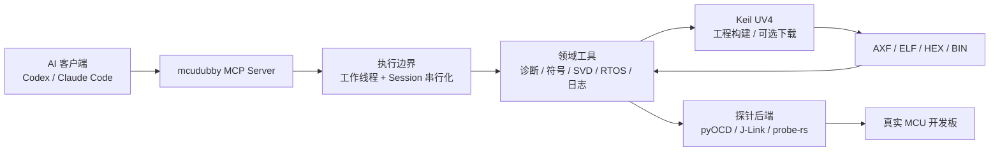

# mcudubby

**让 AI 不只会分析固件代码，也能连接真实 MCU、操作调试工具并收集板级证据。**

> 人负责目标、接线和风险决策，AI 负责调用工具、组织证据和推进调试。

`mcudubby` 是一个面向 MCU 板级调试的
[Model Context Protocol（MCP）](https://modelcontextprotocol.io/) 服务端。它把调试探针、
Keil MDK 工程、ELF/DWARF 符号、CPU 与内存状态、SVD 外设寄存器、UART/RTT 日志、
FreeRTOS 状态、Flash 操作和 GDB Server 统一成 AI 助手可以调用的结构化工具。

项目仍处于 Alpha 阶段，适合固件开发、板卡 Bring-up、故障定位、调试自动化和 AI 辅助
验证。涉及复位、运行控制、内存写入和 Flash 擦写时，应先确认目标、影响和恢复方式。

## 项目解决什么问题

传统 AI 编程助手通常只能阅读代码和日志。真实 MCU 问题往往还需要回答：

- 当前连接了哪个探针，目标芯片是否匹配？
- CPU 停在哪里，寄存器和故障状态说明了什么？
- 某个地址对应哪个函数、源码行或局部变量？
- 外设时钟、中断、GPIO、UART、SPI 或 I2C 寄存器是否配置正确？
- FreeRTOS 任务是否阻塞、栈是否溢出？
- Keil 工程是否构建成功，实际生成了哪个 AXF/HEX/BIN？
- 下载后的 Flash 是否与当前 ELF 一致？

`mcudubby` 让 AI 能继续执行这些检查并返回结构化证据，而不是只根据现象猜测修改代码。

## AI、MCP、mcudubby、Keil 和探针的关系

| 组件 | 主要职责 |
| --- | --- |
| Codex、Claude Code 等 AI 客户端 | 理解问题、选择工具、解释结果、提出下一步检查 |
| MCP | AI 客户端与 `mcudubby` 之间的标准工具调用协议 |
| `mcudubby` | 管理调试 Session、调用后端、组织安全边界并返回结构化结果 |
| Keil MDK / UV4 | 构建和链接 Keil 工程，并可按配置执行固件下载 |
| pyOCD、J-Link、实验性 probe-rs | 连接调试探针，控制目标并读写寄存器、内存、断点和 Flash |
| ELF/AXF、DWARF、SVD | 提供符号、源码、变量、调用栈和外设寄存器语义 |

MCP 不是“调用 Keil 的协议”。AI 通过 MCP 调用 `mcudubby`；`mcudubby` 再根据任务使用
Keil UV4、pyOCD、J-Link 或其他内部后端。



## 核心能力

### 调试探针与目标控制

- 发现 ST-Link、J-Link、CMSIS-DAP 等已连接探针。
- 支持 pyOCD、J-Link，以及实验性的 probe-rs sidecar。
- 执行连接、断开、暂停、继续、复位、单步和运行到指定函数/源码行。
- 读取核心寄存器、FPU、故障寄存器、内存、断点和观察点状态。
- 管理 pyOCD GDB Server 和 J-Link GDB Server 生命周期。

### Keil MDK 工程闭环

- 搜索 `.uvprojx` / `.uvproj` 和配套 `.uvoptx` 工程文件。
- 读取工程 Target、Device、OutputName 和 OutputDirectory。
- 发现 `.axf`、`.elf`、`.hex`、`.bin` 等固件输出。
- 配置 `UV4.exe`、工程、Target、构建日志和下载日志路径。
- 调用 Keil UV4 命令行完成构建；经明确确认后执行下载。
- 将 AXF/ELF 加载到符号系统，再通过探针继续源码级调试和 Flash 对比。

### 符号、源码和故障诊断

- 使用 ELF/AXF 和 DWARF 将地址还原为函数、源码行、局部变量和调用栈。
- 支持反汇编、函数列表、符号读取、源码单步、Step Over 和 Step Out。
- 分析 HardFault、启动失败、内存破坏、栈溢出、中断和时钟问题。
- 对 ELF 与目标 Flash 内容进行读取、比较和校验。

### 外设、RTOS 和日志

- 使用 CMSIS-SVD 读取并解码外设寄存器及字段。
- 检查 UART、SPI、I2C、GPIO、RCC、NVIC 等外设状态。
- 查看 FreeRTOS 任务、任务上下文和栈使用情况。
- 读取 UART、RTT 和部分 J-Link SWO 日志。

完整工具索引见 [Tool Reference](docs/tool-reference.md)，后端覆盖和限制见
[Support Matrix](docs/support-matrix.md)。

## 快速开始

### 1. 准备环境

基本要求：

- Python 3.10 或更高版本；
- 一块已供电的 MCU 开发板；
- 正确连接的 ST-Link、J-Link 或 CMSIS-DAP 探针；
- 目标芯片名称；
- 推荐准备带调试信息的 ELF/AXF。

只有在使用 Keil 构建或下载功能时，才需要 Windows 和已安装的 Keil MDK / UV4。

### 2. 安装

```bash
pip install mcudubby
```

使用 J-Link Python 后端时安装可选依赖：

```bash
pip install "mcudubby[jlink]"
```

从源码开发：

```bash
git clone https://github.com/cunjun/mcudubby.git
cd mcudubby
pip install -e ".[dev]"
```

### 3. 配置 MCP 客户端

```json
{
  "mcpServers": {
    "mcudubby": {
      "command": "python",
      "args": ["-m", "mcudubby"]
    }
  }
}
```

Windows 源码环境建议显式配置虚拟环境 Python 和工作目录，详见
[Windows MCP 配置示例](docs/windows-mcp-config-example.md)。配置后重新启动 AI 客户端。

### 4. 第一次只读检查

连接探针并给开发板供电后，可以直接告诉 AI：

```text
请使用 mcudubby 检查当前调试环境，查找已连接的探针，并在不写入 Flash 的前提下
对开发板做第一次只读检查。开始前先告诉我还缺少哪些信息。
```

推荐流程是先运行环境和目标预检，再配置探针并读取最小状态：

```text
doctor()
list_connected_probes()
match_chip_name("py32f030x8")
configure_probe(target="py32f030x8", backend="pyocd")
board_smoke_test(disconnect_after=True)
```

`board_smoke_test` 不写入 Flash，但默认可能暂停目标以读取稳定上下文，因此属于执行状态变化。
如果设备不能被暂停，应先告诉 AI 只做非侵入式探针和环境检查。

## Keil MDK / UV4 集成

### mcudubby 如何使用 Keil

Keil 在本项目中主要承担工程构建、链接和可选的固件下载。`mcudubby` 不替代 Keil
编译器，也不解析或重写工程构建规则；它负责发现工程、选择 Target、调用 UV4、读取
日志与输出文件，并把结果接入后续自动化调试。

一条完整链路通常是：

```text
发现 Keil 工程
  → 配置 UV4、Target 和日志
  → 调用 Keil 构建
  → 加载生成的 AXF/ELF
  → 通过 pyOCD/J-Link 连接开发板并诊断
  → 用户确认后调用 Keil 下载
  → 重新连接并验证 Flash
```

### 1. 发现并配置工程

假设源码位于 `E:\work_code\app`，Keil 工程位于其 `MDK-ARM` 目录：

```text
discover_keil_projects(root=r"E:\work_code\app")

configure_keil_project(
    project_path=r"E:\work_code\app\MDK-ARM\Project.uvprojx",
    uv4_path=r"C:\Keil_v5\UV4\UV4.exe",
    target_name="Debug",
)
```

也可以只传入 `root` 让工具选择发现到的第一个工程和 Target：

```text
configure_keil_project(
    root=r"E:\work_code\app",
    uv4_path=r"C:\Keil_v5\UV4\UV4.exe",
)
```

自动发现结果应由用户或 AI 检查。一个目录存在多个工程、多个 Target 或多个输出文件时，
建议显式传入 `project_path`、`target_name` 和 `elf_path`。

### 2. 构建并加载 AXF

```text
build_project(timeout_seconds=120)
```

构建完成后，重新运行 `configure_keil_project(...)` 可以刷新固件输出发现；也可以直接指定：

```text
configure_elf(elf_path=r"E:\work_code\app\MDK-ARM\Objects\Project.axf")
elf_load(path=r"E:\work_code\app\MDK-ARM\Objects\Project.axf")
```

加载 AXF 后，AI 才能稳定地把 PC、LR 和内存地址解析为函数、源码行、局部变量与调用栈。

### 3. 连接探针继续调试

Keil 构建与探针后端是两条可以衔接但职责不同的路径：

```text
configure_probe(target="py32f030x8", backend="pyocd")
probe_connect(target="py32f030x8")
probe_halt()
read_stopped_context()
run_to_function("main")
```

如果 Keil、J-Link Commander、GDB Server 或其他调试器已经占用探针，应先关闭对应会话，
否则 pyOCD/J-Link 可能无法连接。

### 4. 下载与验证

`flash_firmware` 会调用配置好的 Keil UV4 下载流程，并修改目标 Flash，因此必须明确确认：

```text
flash_firmware(timeout_seconds=120, confirm=True)
```

下载前应确认工程、Target、固件输出、芯片型号和备份策略。下载完成后重新连接探针，并按需运行：

```text
compare_elf_to_flash()
```

如果只需要校验一段已知字节，可使用 `verify_flash(address=..., data=[...])`。

更完整的新工程接入流程见 [Generic Board Workflow](docs/generic-board-workflow.md)。

## 常见调试流程

### 板卡无法启动或进入 HardFault

```text
probe_halt()
read_stopped_context(include_fault_registers=True)
diagnose_hardfault()
backtrace()
```

### 外设没有输出

```text
svd_load(svd_path=r"C:\path\Device.svd")
svd_read_peripheral(peripheral="RCC")
svd_read_peripheral(peripheral="GPIOA")
diagnose_peripheral_stuck(peripheral="UART")
```

### FreeRTOS 卡住

```text
list_rtos_tasks()
rtos_task_context(task_name="WorkerTask")
read_stack_usage()
```

### 运行到指定源码位置

```text
run_to_function("main")
run_to_source(file="main.c", line=120)
source_step()
step_over()
```

更多证据驱动的决策顺序见 [AI Playbook](docs/ai-playbook.md) 和
[AI Examples](docs/ai-examples.md)。

## 安全模型

`mcudubby` 为工具提供机器可读的安全分类，可通过 `list_tool_safety()` 查询。

| 类别 | 例子 | 默认要求 |
| --- | --- | --- |
| 只读 | 目标匹配、寄存器/内存读取、符号解析、日志、诊断 | 不要求确认 |
| 执行状态变化 | halt、resume、reset、continue、单步 | 不写 Flash，但会改变运行状态 |
| 运行时状态写入 | 内存/寄存器写入、断点、观察点、SVD 字段写入 | 明确确认 |
| 持久性破坏操作 | Flash 擦除、编程、Keil 固件下载 | 明确确认 |
| 主机进程 | Keil 构建、GDB Server 启停 | 会启动或停止本机进程 |

安全原则：

1. 未知目标先匹配芯片和探针，不猜测地址。
2. 优先读取证据，再暂停、复位或写入。
3. Flash 操作前确认目标、范围、镜像和恢复方式。
4. 电机、继电器、电源开关等执行器优先使用断点和低能量测试。

## Session 与并发行为

- 同一个 `Session` 中，共享探针、Keil、ELF/SVD、日志和运行配置的操作会串行执行。
- 不同 Session 可以并行，适合互不相关的多块开发板。
- 目标匹配、工具安全信息等无状态查询可以与 Session 操作并发。
- 取消请求不能强行终止已经进入同步 SDK 的调用；服务器会等工作线程结束后再释放 Session 锁。

这可以避免一个探针操作尚未完成时，另一个请求同时切换后端、断开连接或修改共享状态。

## 后端与验证状态

| 路径 | 当前定位 | 主要能力 |
| --- | --- | --- |
| pyOCD + ST-Link/CMSIS-DAP | 主要后端 | 控制、内存、Flash、源码调试、RTT、RTOS、GDB Server |
| J-Link | 主要后端 | 控制、内存、Flash、源码调试、原生 RTT、DWT、GDB Server |
| probe-rs sidecar | 实验性 | 发现、连接、核心控制、寄存器、内存、硬件断点 |
| Keil UV4（Windows） | 构建/下载后端 | 工程发现、Target 配置、构建、日志、可选下载 |

已重点验证：

- STM32L496VETx + ST-Link / pyOCD；
- STM32F103C8 + J-Link；
- 内置目标预检还包括 STM32F103ZE 和 PY32F030X8。

“代码已实现”不等于“所有板卡均已验证”。准确记录以
[Support Matrix](docs/support-matrix.md) 和 `list_validation_records()` 为准。

## mcubug Skill

仓库包含 `skills/mcubug`，用于指导 Codex 和 Claude Code 按“先证据、后判断”的顺序使用
这些工具，而不是把 MCP 工具当作无序命令列表。

从源码仓库安装到 Codex：

```powershell
python .\skills\mcubug\scripts\install_skill.py --target codex --overwrite
```

安装到 Claude Code：

```powershell
python .\skills\mcubug\scripts\install_skill.py --target cc --overwrite
```

安装完成后重启客户端或新建会话。详细说明见
[mcubug Skill for Codex and CC](docs/mcubug-skill.md)。

## 当前限制

- Keil 构建和下载目前面向 Windows + Keil UV4。
- probe-rs sidecar 仍是实验性后端，尚未覆盖 Flash、RTT、SWO 和正式发布二进制。
- RTOS 检查依赖与目标固件匹配的 FreeRTOS 符号和 ELF/AXF。
- SVD 文件不随所有芯片自动提供，通常需要来自 CMSIS-Pack 或芯片厂商。
- SWO 文本捕获受芯片配置、探针能力、引脚复用和板级接线影响。
- 设备补丁和连接策略仍是轻量机制，不是完整的板卡插件系统。

## 文档导航

- 第一次使用：[Quickstart](docs/quickstart.md)
- 接入任意板卡和 Keil 工程：[Generic Board Workflow](docs/generic-board-workflow.md)
- MCP 会话示例：[MCP Usage Example](docs/mcp-usage-example.md)
- AI 调试决策顺序：[AI Playbook](docs/ai-playbook.md)
- 常见场景示例：[AI Examples](docs/ai-examples.md)
- 完整工具索引：[Tool Reference](docs/tool-reference.md)
- 后端与硬件验证：[Support Matrix](docs/support-matrix.md)
- 项目架构：[Architecture](docs/architecture.md)
- Skill 安装维护：[mcubug Skill](docs/mcubug-skill.md)
- 后续路线：[v0.6 Roadmap](docs/v0.6-roadmap.md)

## 本地开发

```bash
pip install -e ".[dev]"
pytest
ruff check src tests
```

项目目录约定和贡献文档归属见 [Docs Index](docs/README.md)。

## License

MIT，详见 [LICENSE](LICENSE)。
