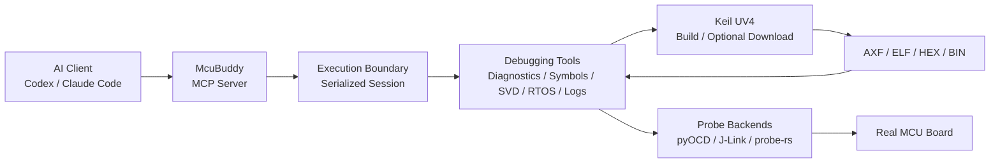

# McuBuddy

[](https://www.python.org/)
[](https://modelcontextprotocol.io/)
[](LICENSE)

**Languages:** [English](README.md) | [中文](README_zh.md)

**Let AI do more than analyze firmware code: connect to real MCUs, operate debugging tools, and collect board-level evidence.**

`McuBuddy` is a [Model Context Protocol (MCP)](https://modelcontextprotocol.io/) server for
MCU board-level debugging. It exposes debug probes, Keil MDK projects, ELF/DWARF symbols,
CPU and memory state, SVD peripheral registers, UART/RTT logs, FreeRTOS state, Flash operations,
and GDB servers as structured tools that AI assistants can call.

It is designed for firmware development, board bring-up, fault isolation, debugging automation,
and AI-assisted validation.

> [!IMPORTANT]
> This project is still in Alpha. Humans remain responsible for goals, wiring, and risk decisions;
> AI calls tools, organizes evidence, and advances the debugging process. Before resets, execution
> control, memory writes, or Flash operations, confirm the target, impact, and recovery plan.

**Documentation:** [Quickstart](docs/quickstart.md) ·
[Tool Reference](docs/tool-reference.md) ·
[Support Matrix](docs/support-matrix.md) ·
[Architecture](docs/architecture.md)

## ✨ Key Features

- **Real-hardware debugging**: Discover and connect to ST-Link, J-Link, CMSIS-DAP, and other
  probes; control target execution; and inspect registers, memory, breakpoints, and watchpoints.
- **Keil project workflow**: Discover `.uvprojx` / `.uvproj` files, select a target, invoke UV4
  builds or downloads, and feed the generated AXF/ELF into the debugging workflow.
- **Source-level fault diagnosis**: Use ELF/DWARF data to resolve addresses to functions, source
  lines, local variables, and call stacks when investigating HardFaults, startup failures, stack
  overflows, and memory corruption.
- **Peripheral and RTOS inspection**: Decode peripheral registers through CMSIS-SVD and inspect
  FreeRTOS tasks, task contexts, and stack usage.
- **Logs and runtime observability**: Read UART, RTT, and selected J-Link SWO logs, and manage
  pyOCD/J-Link GDB server lifecycles.
- **Safety boundaries**: Classify tools as read-only, execution-changing, runtime-writing, or
  persistently destructive, with explicit confirmation for high-risk operations.
- **Evidence-driven results**: Return structured target, state, and validation evidence so AI can
  continue an investigation instead of guessing code changes from symptoms alone.

## 🏗️ How It Works



| Component | Responsibility |
| --- | --- |
| AI clients such as Codex and Claude Code | Understand the problem, select tools, interpret results, and propose the next checks |
| MCP | Standard tool-calling protocol between the AI client and `McuBuddy` |
| `McuBuddy` | Manage debug sessions, invoke backends, enforce safety checks, and return structured results |
| Keil MDK / UV4 | Build and link Keil projects, with optional configured firmware download |
| pyOCD, J-Link, and experimental probe-rs | Connect to probes and access target registers, memory, breakpoints, and Flash |
| ELF/AXF, DWARF, and SVD | Provide symbols, source locations, variables, call stacks, and peripheral-register semantics |

MCP is not a protocol for invoking Keil. The AI calls `McuBuddy` through MCP; `McuBuddy` then
uses Keil UV4, pyOCD, J-Link, or another internal backend as required by the task.

## 🚀 Quick Start

### 1. Prerequisites

Basic requirements:

- Python 3.10 or later;
- a powered MCU development board;
- a correctly connected ST-Link, J-Link, or CMSIS-DAP probe;
- the target chip name;
- preferably, an ELF/AXF image containing debug information.

Windows and an installed Keil MDK / UV4 are required only for Keil build or download features.

### 2. Installation

```bash
pip install McuBuddy
```

Install the optional dependency when using the J-Link Python backend:

```bash
pip install "McuBuddy[jlink]"
```

For development from source:

```bash
git clone https://github.com/cunjun/McuBuddy.git
cd McuBuddy
pip install -e ".[dev]"
```

### 3. Configure an MCP Client

```json
{
  "mcpServers": {
    "McuBuddy": {
      "command": "python",
      "args": ["-m", "McuBuddy"]
    }
  }
}
```

For a Windows source checkout, explicitly configure the virtual-environment Python executable and
working directory. See the [Windows MCP Configuration Example](docs/windows-mcp-config-example.md),
then restart the AI client.

### 4. Run a First Read-Only Check

After connecting the probe and powering the board, tell the AI:

```text
Use McuBuddy to inspect the current debugging environment, discover connected probes,
and perform a first read-only check of the board without writing Flash.
Before starting, tell me what information is still missing.
```

The recommended sequence is to check the environment and target first, then configure the probe
and read the minimum target state:

```text
doctor()
list_connected_probes()
match_chip_name("py32f030x8")
configure_probe(target="py32f030x8", backend="pyocd")
board_smoke_test(disconnect_after=True)
```

`board_smoke_test` does not write Flash, but it may halt the target by default to capture a stable
context, so it is still execution-changing. If the device must not be halted, instruct the AI to
perform only non-intrusive probe and environment checks.

## 💬 Examples for AI Assistants

The following prompts can be given directly to an AI assistant connected to `McuBuddy`.

### Inspect the Probe and Board

```text
List the connected debug probes, confirm that the target chip matches, and perform a read-only
check of the board. Do not reset the target, write memory, or erase or program Flash.
If you identify a risk, stop and explain it first.
```

### Diagnose a HardFault

```text
Halt the target and read PC, LR, SP, and the fault registers. Resolve the call stack using the
current AXF/ELF, identify the most likely source location of the HardFault, and list the evidence
that supports the conclusion.
```

### Build a Keil Project and Continue Debugging

```text
Find the Keil project and targets under the project directory. First tell me which project,
target, and UV4.exe you plan to use. After confirmation, build the project and load the generated
AXF without downloading firmware, then use the probe to run to main.
```

### Inspect Peripheral Configuration

```text
Load an SVD that matches the target chip and inspect the RCC, GPIOA, and UART peripheral state.
Check whether the clock, pin multiplexing, and interrupt configuration are consistent, and explain
any abnormal fields.
```

### Investigate a FreeRTOS Stall

```text
Read the FreeRTOS task list, current task contexts, and stack usage. Identify blocked tasks,
abnormal states, or stack risks without modifying the target state.
```

For more evidence-driven prompts and decision sequences, see the
[AI Playbook](docs/ai-playbook.md) and [AI Examples](docs/ai-examples.md).

## 🧰 Capabilities and Backend Support

### Capability Categories

| Category | Main Capabilities |
| --- | --- |
| Probes and targets | Probe discovery, target matching, connect/disconnect, halt/resume, reset, and stepping |
| CPU and memory | Core/FPU/fault registers, memory access, stopped context, Flash comparison, and verification |
| Breakpoints and execution | Hardware/software breakpoints, watchpoints, run-to-function/source, and Step Over/Out |
| Symbols and source | ELF/AXF, DWARF, disassembly, functions, variables, source mapping, and call stacks |
| Peripherals and RTOS | CMSIS-SVD, peripheral fields, FreeRTOS tasks, task contexts, and stack checks |
| Logs and services | UART, RTT, selected SWO, and pyOCD/J-Link GDB servers |
| Projects and diagnostics | Keil project discovery, build/download, HardFault, startup, clock, interrupt, and peripheral diagnosis |

For complete tool names, parameters, and return values, see the
[Tool Reference](docs/tool-reference.md).

### Backend Support Status

| Path | Current Role | Main Capabilities |
| --- | --- | --- |
| pyOCD + ST-Link/CMSIS-DAP | Primary backend | Control, memory, Flash, source debugging, RTT, RTOS, and GDB server |
| J-Link | Primary backend | Control, memory, Flash, source debugging, native RTT, DWT, and GDB server |
| probe-rs sidecar | Experimental | Discovery, connection, core control, registers, memory, and hardware breakpoints |
| Keil UV4 (Windows) | Build/download backend | Project discovery, target configuration, build, logs, and optional download |

Primary validation coverage includes:

- STM32L496VETx + ST-Link / pyOCD;
- STM32F103C8 + J-Link;
- built-in target preflight profiles for STM32F103ZE and PY32F030X8.

“Implemented in code” does not mean “validated on every board.” Use the
[Support Matrix](docs/support-matrix.md) and `list_validation_records()` as the source of truth.

## 🔄 Keil MDK / UV4 Workflow

Keil provides project build, linking, and optional firmware download. `McuBuddy` does not replace
the Keil compiler or parse and rewrite project build rules. It discovers projects, selects targets,
invokes UV4, reads logs and output files, and feeds the results into automated debugging.

```text
Discover the Keil project
  → Configure UV4, the target, and logs
  → Invoke the Keil build
  → Load the generated AXF/ELF
  → Connect through pyOCD/J-Link and diagnose the board
  → Download through Keil after user confirmation
  → Reconnect and verify Flash
```

### 1. Discover and Configure a Project

```text
discover_keil_projects(root=r"E:\work_code\app")

configure_keil_project(
    project_path=r"E:\work_code\app\MDK-ARM\Project.uvprojx",
    uv4_path=r"C:\Keil_v5\UV4\UV4.exe",
    target_name="Debug",
)
```

The user or AI should review automatic discovery results. When a directory contains multiple
projects, targets, or output files, explicitly specify `project_path`, `target_name`, and `elf_path`.

### 2. Build and Load the AXF

```text
build_project(timeout_seconds=120)
configure_elf(elf_path=r"E:\work_code\app\MDK-ARM\Objects\Project.axf")
elf_load(path=r"E:\work_code\app\MDK-ARM\Objects\Project.axf")
```

Once the AXF is loaded, the AI can reliably resolve PC, LR, and memory addresses to functions,
source lines, local variables, and call stacks.

### 3. Connect the Probe and Continue Debugging

```text
configure_probe(target="py32f030x8", backend="pyocd")
probe_connect(target="py32f030x8")
probe_halt()
read_stopped_context()
run_to_function("main")
```

If Keil, J-Link Commander, a GDB server, or another debugger already owns the probe, close that
session first; otherwise pyOCD or J-Link may fail to connect.

### 4. Download and Verify

`flash_firmware` invokes the configured Keil UV4 download flow and modifies target Flash, so it
requires explicit confirmation:

```text
flash_firmware(timeout_seconds=120, confirm=True)
compare_elf_to_flash()
```

Before downloading, confirm the project, target, firmware output, chip model, and recovery plan.
For the complete new-project workflow, see the
[Generic Board Workflow](docs/generic-board-workflow.md).

## 🔍 Common Debugging Workflows

### Board Does Not Start or Enters HardFault

```text
probe_halt()
read_stopped_context(include_fault_registers=True)
diagnose_hardfault()
backtrace()
```

### Peripheral Produces No Output

```text
svd_load(svd_path=r"C:\path\Device.svd")
svd_read_peripheral(peripheral="RCC")
svd_read_peripheral(peripheral="GPIOA")
diagnose_peripheral_stuck(peripheral="UART")
```

### FreeRTOS Stalls

```text
list_rtos_tasks()
rtos_task_context(task_name="WorkerTask")
read_stack_usage()
```

### Run to a Source Location

```text
run_to_function("main")
run_to_source(file="main.c", line=120)
source_step()
step_over()
```

## 🛡️ Safety Model

`McuBuddy` provides machine-readable safety classifications through `list_tool_safety()`.

| Category | Examples | Default Requirement |
| --- | --- | --- |
| Read-only | Target matching, register/memory reads, symbol resolution, logs, diagnostics | No confirmation required |
| Execution-changing | halt, resume, reset, continue, stepping | Does not write Flash, but changes execution state |
| Runtime-state write | Memory/register writes, breakpoints, watchpoints, SVD field writes | Explicit confirmation |
| Persistent destructive operation | Flash erase/program, Keil firmware download | Explicit confirmation |
| Host process | Keil build, GDB server start/stop | Starts or stops a local process |

Safety principles:

1. For an unknown target, match the chip and probe first; do not guess addresses.
2. Read evidence before halting, resetting, or writing.
3. Before a Flash operation, confirm the target, scope, image, and recovery method.
4. For motors, relays, power switches, and other actuators, prefer breakpoints and low-energy tests.

## 🔒 Sessions and Concurrency

- Operations that share probe, Keil, ELF/SVD, log, and runtime configuration are serialized within
  the same `Session`.
- Different sessions can run concurrently when they control unrelated boards.
- Stateless queries such as target matching and tool safety information can run alongside session
  operations.
- Cancellation cannot forcibly terminate a call that has entered a synchronous SDK. The server
  waits for the worker thread to finish before releasing the session lock.

This prevents one request from switching backends, disconnecting the probe, or changing shared
state while another probe operation is still running.

## 📦 mcubug Skill

The repository includes `skills/mcubug`, which guides Codex and Claude Code to use these tools in an
“evidence first, judgment second” sequence instead of treating MCP tools as an unordered command list.

Install for Codex:

```powershell
python .\skills\mcubug\scripts\install_skill.py --target codex --overwrite
```

Install for Claude Code:

```powershell
python .\skills\mcubug\scripts\install_skill.py --target cc --overwrite
```

Restart the client or open a new session after installation. See
[mcubug Skill for Codex and Claude Code](docs/mcubug-skill.md) for details.

## ⚠️ Current Limitations

- Keil build and download currently target Windows + Keil UV4.
- The probe-rs sidecar remains experimental and does not yet cover Flash, RTT, SWO, or an official
  binary release.
- RTOS inspection depends on FreeRTOS symbols and an ELF/AXF that match the target firmware.
- SVD files are not bundled automatically for every chip and usually come from a CMSIS-Pack or
  the chip vendor.
- SWO text capture depends on chip configuration, probe capabilities, pin multiplexing, and board wiring.
- Device patches and connection strategies remain lightweight mechanisms rather than a complete
  board plugin system.

## 📚 Documentation

- First-time setup: [Quickstart](docs/quickstart.md)
- Any board and Keil project: [Generic Board Workflow](docs/generic-board-workflow.md)
- MCP session walkthrough: [MCP Usage Example](docs/mcp-usage-example.md)
- AI debugging decision order: [AI Playbook](docs/ai-playbook.md)
- Common scenarios: [AI Examples](docs/ai-examples.md)
- Complete tool index: [Tool Reference](docs/tool-reference.md)
- Backend and hardware validation: [Support Matrix](docs/support-matrix.md)
- Project design: [Architecture](docs/architecture.md)
- Skill installation and maintenance: [mcubug Skill](docs/mcubug-skill.md)
- Planned work: [v0.6 Roadmap](docs/v0.6-roadmap.md)

## 🧪 Local Development

```bash
pip install -e ".[dev]"
pytest
ruff check src tests
```

See the [Docs Index](docs/README.md) for repository layout and documentation ownership.

## 📄 License

This project is licensed under the MIT License. See [LICENSE](LICENSE) for details.

---

If `McuBuddy` helps with your MCU debugging workflow, consider giving the project a Star.
