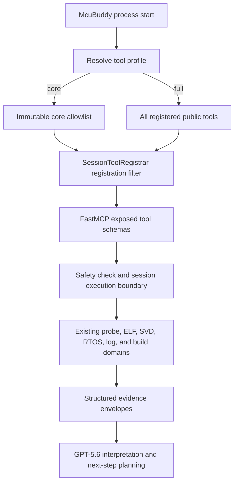

# GPT-5.6-Oriented Tool Surface Refactor - Plan

## Goal Capsule

- **Objective:** 将 McuBuddy 从默认暴露 104 个工具的大型目录，改造成默认精简、证据优先、完整能力按需启用的 MCU 调试 MCP 服务。
- **Authority:** 用户确认的破坏性默认切换优先于旧客户端兼容；本计划的 Product Contract 优先于现有 v0.6 roadmap 中“继续增强 diagnose 编排”的方向；现有安全、会话串行化和真实硬件验证约束不得退化。
- **Execution profile:** 以测试先行的方式重构工具注册边界，再增加证据采集入口，随后更新 Skill、文档和发布元数据。
- **Stop conditions:** 如果精简模式无法在 MCP 注册阶段真正减少工具 schema，或任何实现会绕过 `SessionToolRegistrar` 的安全/串行化边界，则停止并重新设计，不接受仅在文档中隐藏工具的替代方案。若两条目标硬件路径在发布验证阶段不可用，代码工作可以完成，但不得宣称版本达到 release-ready 或伪造验证记录。
- **Tail ownership:** 完成代码、测试、文档同步和验证；不删除探针后端，不创建 git commit，除非用户另行明确要求。

---

## Product Contract

### Summary

下一版本默认启动 `core` 工具配置，仅向模型暴露覆盖常见 bring-up、故障取证、外围设备、RTOS、日志和构建验证闭环的工具。完整低层调试、实验后端和旧式高层诊断仍由 `full` 配置提供，但使用者必须在 MCP 配置中显式启用。

### Problem Frame

McuBuddy 当前一次性注册 104 个 MCP 工具。大量名称相近、前置条件不同的工具提高了模型选错工具、重复调用和加载无关 schema 的概率，也让 Skill 和操作文档承担了过多路由说明。

GPT-5.6 已具备更强的多步推理和程序化工具调用能力。McuBuddy 的长期价值应集中在真实硬件接入、确定性证据、安全边界、会话一致性和后端适配，而不是继续用关键词路由和固定结论复制模型推理。

### Requirements

**Tool exposure**

- R1. 服务在未提供配置时必须使用 `core` 工具配置，并在 MCP 注册阶段只注册核心工具。
- R2. 服务必须提供显式 `full` 工具配置，暴露现有全部公共工具以及本次新增的证据采集工具；除 R6 为安全查询增加的可选参数和返回元数据外，现有工具参数 schema 保持不变。
- R3. 工具配置只能在服务启动时确定；运行中的会话不得通过 MCP 工具扩大自身可用能力。
- R4. 无效工具配置必须在服务启动时失败并给出可操作的错误信息，不得静默回退到 `full`。
- R5. Python 嵌入方必须能通过 `create_server(...)` 显式选择配置，stdio 用户必须能通过 `MCUBUDDY_TOOL_PROFILE` 选择配置。
- R6. `list_tool_safety()` 默认只返回当前暴露工具的策略，同时报告当前配置；调用者可显式要求查看未暴露工具的元数据。

**Evidence-first diagnosis**

- R7. `core` 必须提供 crash、startup、peripheral 和 RTOS 四类结构化证据采集入口。
- R8. 证据采集入口必须复用已有领域工具和统一结果封装，返回事实、缺失前置条件、安全影响和可选后续工具，不输出无法由采集数据直接证明的根因结论。
- R9. 现有 `diagnose(...)`、`run_debug_loop(...)` 和各类高层诊断工具不得出现在 `core`，但在 `full` 中继续可用，避免本次改造同时重写所有领域诊断实现。

**Safety and runtime behavior**

- R10. 所有新增和保留工具必须继续通过 `SessionToolRegistrar` 执行，不得绕过确认检查、工作线程隔离或同会话串行化。
- R11. `TOOL_POLICIES` 仍是全部公共工具安全分类的唯一来源，工具配置只决定暴露范围，不得复制或覆盖安全级别。
- R12. pyOCD、J-Link、probe-rs、Keil、ELF/DWARF、SVD、RTOS 和日志领域实现不得因工具精简而删除或降低能力。

**Documentation and release**

- R13. Quickstart、README、tool reference、AI playbook、mcubug Skill 和其同步引用必须解释 `core`/`full` 的差异与迁移方式。
- R14. v0.6 roadmap 必须把“增强硬编码 diagnose 编排”改为“增强证据包与模型评测”，避免后续重新扩大默认工具面。
- R15. 发布元数据必须升级到 `0.6.0`，并在 changelog/release notes 中明确这是预 1.0 阶段的破坏性默认行为变更。

### Core Tool Contract

`core` 的首版允许列表固定为以下工具；新增工具不得自动进入 `core`，必须经过显式评审和测试更新：

- **Preflight and configuration:** `doctor`, `first_contact`, `list_tool_safety`, `list_validation_records`, `match_chip_name`, `get_target_info`, `list_connected_probes`, `configure_probe`, `configure_elf`, `elf_load`, `svd_load`, `probe_connect`, `disconnect_all`。
- **Execution and context:** `probe_halt`, `probe_resume`, `probe_reset`, `read_stopped_context`, `backtrace`。
- **Evidence packages:** `collect_crash_evidence`, `collect_startup_evidence`, `collect_peripheral_evidence`, `collect_rtos_evidence`。
- **Observability:** `svd_read_peripheral`, `list_rtos_tasks`, `rtos_task_context`, `read_rtt_log`, `configure_log`, `log_connect`, `log_tail`。
- **Build and verification:** `discover_keil_projects`, `configure_keil_project`, `build_project`, `flash_firmware`, `compare_elf_to_flash`。

### Key Flows

- F1. Default startup
  - **Trigger:** MCP 客户端按新的 Quickstart 启动 McuBuddy，未指定工具配置。
  - **Actors:** MCP 客户端、McuBuddy 服务。
  - **Steps:** 服务解析默认配置，注册 `core` 允许列表中的工具，向客户端公开精简 schema。
  - **Outcome:** 客户端看不到高级写内存、复杂断点、trace、GDB server、实验性和旧诊断编排工具。
- F2. Expert opt-in
  - **Trigger:** 高级用户在 MCP 配置中设置 `MCUBUDDY_TOOL_PROFILE=full`。
  - **Actors:** 高级用户、MCP 客户端、McuBuddy 服务。
  - **Steps:** 服务启动时解析 `full`，注册完整工具目录并保持现有工具名称和行为。
  - **Outcome:** 旧式高级工作流可继续运行，但迁移责任明确由使用者承担。
- F3. Evidence-driven investigation
  - **Trigger:** 模型收到 HardFault、启动失败、外围设备无输出或 RTOS 卡死症状。
  - **Actors:** GPT-5.6/Codex、McuBuddy、目标板。
  - **Steps:** 模型调用对应证据入口；McuBuddy 检查前置条件并采集结构化事实；模型基于结果决定是否请求 `full` 或继续核心闭环。
  - **Outcome:** McuBuddy 提供可靠证据，不与模型重复竞争自然语言根因判断。

### Acceptance Examples

- AE1. 未设置环境变量创建服务时，MCP 工具列表精确等于 `CORE_TOOL_NAMES`，且不包含 `diagnose`、`run_debug_loop` 或 `probe_write_memory`。
- AE2. 设置 `MCUBUDDY_TOOL_PROFILE=full` 时，原有 104 个工具全部存在，并额外包含四个证据入口；只有 `list_tool_safety()` 按 R6 获得新的可选查询参数。
- AE3. 设置未知配置值时，进程在建立 MCP stdio 会话前退出，错误信息列出 `core` 和 `full` 两个合法值。
- AE4. `collect_crash_evidence` 在探针未连接时返回标准错误 envelope 和缺失前置条件，不尝试读取寄存器。
- AE5. `collect_crash_evidence` 在已连接目标上按安全策略执行，返回核心寄存器、fault registers、符号/源码、栈和日志中实际可取得的部分，不声称未经证据证明的根因。
- AE6. `core` 与 `full` 中的 `probe_halt` 都保持同会话串行化；取消中的同步 SDK 调用仍持有会话锁直至工作线程结束。
- AE7. `list_tool_safety()` 在 `core` 中只列核心工具并标明 `active_profile=core`；显式请求完整目录时返回全部工具策略但不改变 MCP 暴露面。
- AE8. 文档中的默认配置可完成首次连接、HardFault 取证、外围设备读取、RTOS 检查和 Keil build/flash/verify 示例。

### Success Criteria

- 默认暴露工具数从 104 降至固定核心集合，且该集合由精确集合测试锁定。
- 核心模式覆盖现有文档中的五条主要用户闭环，不要求用户为常见故障立即切换 `full`。
- 完整模式保持原有工具名称、安全级别和会话执行语义；除 `list_tool_safety()` 的向后兼容可选参数外，原有参数 schema 不变。
- 四个证据入口均使用统一结果 envelope，并具有成功、缺失前置条件、部分证据和安全状态测试。
- Skill 主文件只保留选择证据入口、切换配置和安全边界所需的指令；详细工具目录仍按需加载。

### Scope Boundaries

#### Included

- 工具配置解析、注册过滤、活动配置可观测性。
- 四类证据入口和现有领域采集逻辑的复用/抽取。
- `core`/`full` 相关测试、Skill、文档、roadmap 和发布元数据。

#### Deferred to Follow-Up Work

- 根据真实 GPT-5.6 故障集继续调整核心允许列表。
- 删除旧高层诊断实现或进一步拆分 `full` 为多个专家配置。
- MCP 协议未来支持动态工具发现时的按需加载。

#### Outside This Product's Identity

- 在 McuBuddy 内部调用 OpenAI API 或绑定特定模型。
- 删除 pyOCD、J-Link、probe-rs 或 Keil 后端。
- 以自然语言规则引擎取代模型的最终诊断判断。

---

## Planning Contract

### Key Technical Decisions

- KTD1. **下一版本默认切换到精简工具配置。** `(session-settled: user-directed — chosen over compatibility-first rollout: the user selected a breaking default so the product can simplify decisively.)` 目标版本定为 `0.6.0`；项目仍处于 Alpha，发布说明必须突出迁移步骤。
- KTD2. **只提供 `core` 与 `full` 两个启动配置。** 首版不引入可组合领域 profile，避免新的配置矩阵取代当前工具目录复杂度。
- KTD3. **在装饰器注册时过滤工具。** `SessionToolRegistrar` 根据不可变允许列表决定是否调用底层 `FastMCP.tool()`；注册完成后隐藏或仅靠提示词禁止都不能减少客户端收到的 schema。
- KTD4. **配置优先级为显式 Python 参数高于环境变量高于 `core` 默认值。** 这同时支持单元测试、嵌入式调用和通用 stdio 客户端，不向 `FastMCP.run()` 注入自定义 CLI 参数。
- KTD5. **暴露策略与安全策略分离。** 新的工具配置模块只维护工具成员关系；`tool_safety.py` 继续维护安全等级和执行模式，测试负责证明两者覆盖一致。
- KTD6. **证据入口返回观测而不是推测。** 所有入口复用 `make_result()`，`evidence` 中使用带 `kind` 的结构化项；`summary` 只描述完成度，`next_tools` 只建议下一步，不写“最可能根因”。
- KTD7. **旧诊断工具只从默认面移除，不在本次删除。** `full` 继续注册它们，使改造可以单独验证工具选择收益，而不把行为重写和 API 删除混进同一版本。
- KTD8. **模型不能在 MCP 会话内自行升级到 `full`。** 当核心证据不足时，结果只能说明所需能力和迁移方法；用户必须修改启动配置并重启服务，防止低权限会话扩大自身写入或调试能力。

### High-Level Technical Design

`src/McuBuddy/tool_profiles.py` owns profile names, validation, environment resolution and `CORE_TOOL_NAMES`。`src/McuBuddy/server.py` resolves the profile and passes its enabled set through `register_all_tools(...)` to `SessionToolRegistrar`。Disabled decorators return the original callback without registering it, so domain registration modules remain thin and do not gain profile conditionals。

`src/McuBuddy/tools/evidence.py` owns deterministic orchestration and result shaping。`src/McuBuddy/mcp_tools/evidence.py` remains a thin MCP wrapper。Existing `diagnostic_context.py`, fault register readers, RTOS tools and SVD tools are reused; any shared raw collector extracted from old diagnosis modules must preserve their public `full` behavior。

### System-Wide Impact

- **Public MCP contract:** 默认工具列表发生破坏性变化；显式 `full` 是迁移通道，不保证旧配置零修改运行。
- **Safety:** 新证据工具可能 halt/reset 目标，必须按实际行为标为 execution-changing；外围设备和 RTOS 入口在纯读路径下保持 read-only。
- **Agent context:** 默认 schema 数量显著下降；Skill 不再承担在 100 多个工具中路由的职责。
- **Capability lifecycle:** profile 在进程生命周期内不可变；从 core 切换到 full 会重建 MCP 会话和硬件会话，因此文档必须要求先安全断开探针和日志连接。
- **Documentation sync:** `docs/*.md` 是源，`skills/mcubug/references/*.md` 必须通过现有同步脚本保持一致。
- **Hardware validation:** 自动测试只能证明编排与契约；真实板卡仍需覆盖 STM32L496VETx + ST-Link 和 STM32F103C8 + J-Link 的代表流程。

### Sequencing

1. 先冻结五类 GPT-5.6 场景并记录当前 104 工具服务的 full baseline，避免改造后才定义成功标准。
2. 建立工具配置模型和解析测试，但暂不改变默认注册行为。
3. 加入证据入口并让现有全量服务注册它们，先验证领域采集和旧诊断兼容。
4. 再启用注册过滤和 profile-aware safety 查询，一次性形成最终 core/full 工具契约。
5. 然后重写 Skill、Quickstart 和 AI playbook，使默认使用方式与新工具面一致。
6. 最后更新版本、registry、roadmap 和 release notes，并完成自动化、模型对比和硬件验证。

### Risks and Mitigations

| Risk | Impact | Mitigation |
|---|---|---|
| 核心集合过小 | 常见调试中途被迫重启为 `full` | 用五条主要闭环和两块已验证开发板做验收；本版允许调整固定列表，但发布后新增核心工具必须评审 |
| 核心集合再次膨胀 | 回到大型工具目录 | 精确集合测试、文档中的准入原则、禁止自动把新工具加入 core |
| 注册过滤绕过安全封装 | 工具直接执行或缺失确认 | 过滤逻辑只能位于 `SessionToolRegistrar.tool()`，所有已注册工具继续走同一 execute wrapper |
| 证据入口夹带启发式结论 | 与模型推理重复且可能误导 | 对 envelope 字段做结构测试；保留原诊断结论仅在 full；评审中禁止无证据根因措辞 |
| 文档与 Skill 漂移 | 模型调用隐藏工具或缺失配置 | 继续使用引用同步检查，并给核心工具目录增加文档契约测试 |
| 破坏性升级不够醒目 | 现有用户认为工具消失是故障 | README、Quickstart、CHANGELOG、RELEASE_NOTES 和 MCP 配置示例全部加入迁移段落 |
| profile 切换丢失硬件会话状态 | 用户在目标运行或连接占用时直接重启 | 迁移文档要求先执行 `disconnect_all`；core 结果不得暗示可在当前会话内直接启用 full |

### Research Anchors

- `src/McuBuddy/mcp_execution.py`：当前所有工具统一经过工作线程、安全确认和会话锁的注册边界，是过滤逻辑的正确落点。
- `src/McuBuddy/mcp_tools/__init__.py`：当前领域注册汇总点，可在不侵入各后端的前提下传递工具配置。
- `src/McuBuddy/tool_safety.py`：104 个工具的安全和执行策略单一注册表，必须继续保持全量覆盖。
- `src/McuBuddy/result.py`：已有标准 AI result envelope，应作为新证据入口的返回契约。
- `tests/unit/test_mcp_concurrency.py`：已有精确工具数和执行边界测试，是 profile 化后的回归基线。
- `docs/v0.6-roadmap.md`：当前仍把增强 `diagnose(symptom)` 设为最高价值方向，需要随产品定位同步修订。
- [OpenAI GPT-5.6 model guidance](https://developers.openai.com/api/docs/guides/latest-model)：GPT-5.6 支持程序化工具调用，并建议在工具密集型工作流中以代表性任务评测最终成功率、证据完整性、调用次数、延迟和成本。

---

## Implementation Units

### U8. Pre-change GPT-5.6 evaluation baseline

- **Goal:** 在改变工具面之前固定场景、评价口径和当前 full 行为基线，使“精简是否更好”成为可复现判断。
- **Requirements:** R7, R8, R13。
- **Dependencies:** 无；必须在 U1-U7 的行为改造前完成基线采集。
- **Files:** `tests/evaluation/gpt5p6_scenarios.yaml`, `docs/ai-tool-surface-evaluation.md`, `docs/board-validation-guide.md`。
- **Approach:** 定义 board bring-up、HardFault、UART 无输出、FreeRTOS 卡死和 Keil build/flash 五个固定场景；记录模型版本、profile、任务完成、必需证据、错误/无效调用、高风险调用、总调用数和无法完成原因；基线只使用当前 full 工具面，不修改产品代码。
- **Test Scenarios:**
  1. 每个场景都有明确输入、完成条件、必需证据和禁止操作。
  2. 同一场景可在改造后的 core/full 上重复执行，不依赖机器私有绝对路径或不可公开固件内容。
  3. 未连接真实硬件时明确标为不可执行，不把 mock 结果计入硬件成功率。
- **Verification:** 场景文件可被测试解析，baseline 文档包含五个场景的同一字段集合，并记录未执行项及原因。

### U1. Tool profile model and startup resolution

- **Goal:** 建立不可变、可验证的 `core`/`full` 配置契约和启动解析规则。
- **Requirements:** R1, R2, R3, R4, R5。
- **Files:** `src/McuBuddy/tool_profiles.py`, `src/McuBuddy/server.py`, `src/McuBuddy/__main__.py`, `tests/unit/test_tool_profiles.py`。
- **Approach:** 定义 profile 值对象和核心允许列表；实现显式参数、环境变量和默认值优先级；未知值在创建 FastMCP 前失败。
- **Test Scenarios:**
  1. 无参数和环境变量时解析为 `core`。
  2. 环境变量可选择 `full`。
  3. 显式 Python 参数覆盖环境变量。
  4. 大小写、空白和未知值按文档约定处理；未知值列出合法选项。
  5. 核心列表没有重复项，profile 对象在创建后不可修改。
- **Verification:** `pytest tests/unit/test_tool_profiles.py`。

### U2. Registration-time tool filtering

- **Goal:** 让 MCP 客户端实际只收到活动配置的工具 schema，同时保持执行边界不变。
- **Requirements:** R1, R2, R3, R10, R11。
- **Dependencies:** U1, U4。
- **Files:** `src/McuBuddy/mcp_execution.py`, `src/McuBuddy/mcp_tools/__init__.py`, `src/McuBuddy/server.py`, `tests/unit/test_mcp_concurrency.py`, `tests/unit/test_tool_safety.py`, `tests/integration/test_tool_profiles.py`。
- **Approach:** 为 `SessionToolRegistrar` 注入活动 profile/允许集合；仅允许的 callback 调用 `FastMCP.tool()`；为测试暴露只读的活动名称，不在运行期提供 profile 切换工具。
- **Test Scenarios:**
  1. 默认服务的工具名称精确等于核心集合。
  2. `full` 包含原 104 个公共名称；除 `list_tool_safety()` 的新增可选参数外，每个参数 schema 与改造前一致。
  3. disabled callback 没有进入 FastMCP manager，但不会阻止模块导入和 full 注册。
  4. core/full 中的串行、并发、取消和异常释放锁测试全部保持原行为。
  5. 所有实际注册工具都有安全策略，所有 profile 名称都指向合法策略项。
- **Verification:** `pytest tests/unit/test_mcp_concurrency.py tests/unit/test_tool_safety.py tests/integration/test_tool_profiles.py`。

### U3. Profile-aware safety discovery

- **Goal:** 让模型和用户知道当前工具配置，而不会误以为隐藏工具可以直接调用。
- **Requirements:** R6, R11。
- **Dependencies:** U2。
- **Files:** `src/McuBuddy/tool_safety.py`, `src/McuBuddy/mcp_tools/runtime.py`, `tests/unit/test_tool_safety.py`。
- **Approach:** 扩展安全列表查询以接收活动集合和 profile；默认只呈现活动工具，显式参数可查询完整策略目录；该参数只影响返回数据，不触发注册或权限变化。
- **Test Scenarios:**
  1. core 返回 `active_profile=core` 且只包含核心策略。
  2. full 返回全部策略。
  3. core 显式查询完整目录时可看到隐藏工具元数据，但 FastMCP 工具表不改变。
  4. 未知工具仍采用保守安全默认值。
- **Verification:** `pytest tests/unit/test_tool_safety.py tests/integration/test_tool_profiles.py`。

### U4. Structured evidence collectors

- **Goal:** 提供四个模型友好的证据入口，替代核心模式中的关键词诊断和固定调试循环。
- **Requirements:** R7, R8, R9, R10。
- **Dependencies:** 无；先在当前全量注册行为下建立证据基线，再由 U2 纳入 profile 过滤。
- **Files:** `src/McuBuddy/tools/evidence.py`, `src/McuBuddy/mcp_tools/evidence.py`, `src/McuBuddy/mcp_tools/__init__.py`, `src/McuBuddy/tool_safety.py`, `src/McuBuddy/tools/diagnostic_context.py`, `src/McuBuddy/tools/diagnose_hardfault.py`, `src/McuBuddy/tools/diagnose_startup.py`, `tests/unit/test_evidence_tools.py`, `tests/integration/test_evidence_workflows.py`。
- **Approach:** 将可复用的原始采集从旧诊断代码中抽出；四个入口统一使用 `make_result()`，每条 evidence 使用稳定 `kind`；允许部分成功并明确记录 unavailable/failed observation；旧诊断工具复用同一采集器后再执行其现有分类逻辑。
- **Test Scenarios:**
  1. crash 入口覆盖未连接、已 halt、自动 halt、无 ELF、有 ELF、无日志和部分读取失败。
  2. startup 入口覆盖 vector/context/log 证据、可选 reset/halt 的执行状态和禁止静默复位。
  3. peripheral 入口覆盖缺失 SVD、指定外围设备、RCC/GPIO 相关证据可用和部分寄存器不可读。
  4. RTOS 入口覆盖缺失 ELF、无 FreeRTOS 符号、任务列表、指定任务上下文和栈证据。
  5. 所有入口的 summary 不包含“root cause”“most likely”等未经直接证明的判断；需要隐藏能力时只报告所需 profile，不声称能够在当前会话内启用它。
  6. full 中旧诊断工具的现有集成测试保持通过。
- **Verification:** `pytest tests/unit/test_evidence_tools.py tests/integration/test_evidence_workflows.py tests/integration/test_diagnose_router.py tests/integration/test_debug_loop.py`。

### U5. Core-first Skill and operator documentation

- **Goal:** 让默认安装、模型指导和迁移文档全部围绕核心工具与证据闭环。
- **Requirements:** R13, R14。
- **Dependencies:** U2, U3, U4。
- **Files:** `skills/mcubug/SKILL.md`, `docs/quickstart.md`, `docs/tool-reference.md`, `docs/ai-playbook.md`, `docs/ai-examples.md`, `docs/mcp-usage-example.md`, `docs/windows-mcp-config-example.md`, `docs/mcubug-skill.md`, `docs/v0.6-roadmap.md`, `README.md`, `skills/mcubug/references/*.md`, `tests/unit/test_skill_reference_sync.py`, `tests/unit/test_tool_profile_docs.py`。
- **Approach:** Quickstart 默认 core；将完整目录分成“core 默认”和“full 专家工具”；Skill 默认从对应证据入口开始，只在核心闭环不足时建议重启为 full；roadmap 停止扩展关键词路由，改为证据完整性和模型评测。
- **Test Scenarios:**
  1. 所有默认示例只引用 core 工具。
  2. 每个 full-only 示例同时标明启动配置和风险边界。
  3. 文档列出的 core 集合与代码允许列表完全一致。
  4. docs 与 Skill references 同步检查无漂移，Skill 本地链接有效。
- **Verification:** `python skills/mcubug/scripts/sync_references.py --check`, `python skills/mcubug/scripts/validate_skill.py`, `pytest tests/unit/test_skill_reference_sync.py tests/unit/test_tool_profile_docs.py`。

### U6. Release metadata and migration contract

- **Goal:** 以 `0.6.0` 发布清晰的破坏性默认变化和迁移说明。
- **Requirements:** R15。
- **Dependencies:** U1, U2, U5。
- **Files:** `pyproject.toml`, `server.json`, `src/McuBuddy/__init__.py`, `tests/unit/test_registry_metadata.py`, `tests/unit/test_package_version.py`, `CHANGELOG.md`, `RELEASE_NOTES.md`, `README.md`。
- **Approach:** 同步包与 registry 版本；发布说明给出 core 默认、full 环境变量配置、工具移出默认面的分类和回退步骤；不把 `full` 描述为已弃用。
- **Test Scenarios:**
  1. 安装分发元数据、包版本和 `server.json` 一致为 `0.6.0`。
  2. migration 文档包含旧配置升级到 full 的可复制示例。
  3. release notes 明确默认工具消失是设计变化，不是后端能力删除。
- **Verification:** `pytest tests/unit/test_registry_metadata.py tests/unit/test_package_version.py`。

### U7. Model and hardware validation

- **Goal:** 证明精简工具面改善工具选择，同时不损失主要真实板卡闭环。
- **Requirements:** R7, R8, R10, R12, R13。
- **Dependencies:** U2, U4, U5, U6, U8。
- **Files:** `docs/board-validation-guide.md`, `docs/support-matrix.md`, `src/McuBuddy/validation/*.json`, `skills/mcubug/references/board-validation-guide.md`, `skills/mcubug/references/support-matrix.md`。
- **Approach:** 建立固定的 GPT-5.6 场景集，分别在 core 与 full 下记录完成率、正确证据、错误/无效调用、调用次数和高风险操作；在两条已验证硬件路径上执行代表性的 crash、peripheral、RTOS/RTT 和 build/flash 验证。
- **Test Scenarios:**
  1. core 在 board bring-up、HardFault、UART 无输出、FreeRTOS 卡死和 Keil build/flash 五类场景中均能完成或给出明确切换 full 的原因。
  2. core 不调用未暴露工具，不因缺失工具编造执行结果。
  3. 两个 profile 下所有写入和 flash 操作仍要求同一确认条件。
  4. STM32L496VETx + ST-Link/pyOCD 完成 startup、RTOS 和外围设备代表流程。
  5. STM32F103C8 + J-Link 完成 crash、RTT 和 build/flash 代表流程。
- **Verification:** 按 `docs/board-validation-guide.md` 记录真实硬件结果；只有真实执行过的能力才更新 validation records 和 support matrix。

---

## Verification Contract

| Gate | Command or evidence | Covers | Passing signal |
|---|---|---|---|
| Profile contract | `pytest tests/unit/test_tool_profiles.py tests/integration/test_tool_profiles.py` | U1-U3 | core 精确集合、full 全量集合、解析和安全查询全部通过 |
| Evidence behavior | `pytest tests/unit/test_evidence_tools.py tests/integration/test_evidence_workflows.py` | U4 | 四类成功/部分成功/缺失前置条件 envelope 全部通过 |
| Legacy full behavior | `pytest tests/integration/test_diagnose_router.py tests/integration/test_debug_loop.py tests/unit/test_mcp_concurrency.py` | U2, U4 | 旧诊断和执行边界无回归 |
| Documentation sync | `python skills/mcubug/scripts/sync_references.py --check` | U5, U7 | 无引用漂移 |
| Skill validation | `python skills/mcubug/scripts/validate_skill.py` | U5 | Skill 结构和链接有效 |
| Static quality | `ruff check src tests scripts skills/mcubug/scripts` | U1-U6 | 无 Ruff 问题 |
| Full automated suite | `pytest` | U1-U6 | 全部单元和集成测试通过 |
| Hardware validation | `docs/board-validation-guide.md` 的两条板卡记录 | U7 | 记录包含设备、探针、profile、固件、证据和限制；未执行项不标为已验证 |
| GPT-5.6 scenario baseline | `tests/evaluation/gpt5p6_scenarios.yaml` 和改造前 full 结果 | U8 | 五场景结构可解析，完成条件和禁止操作明确，基线记录可复现 |
| GPT-5.6 scenario comparison | 固定五场景 baseline/core/full 结果表 | U5, U7, U8 | core 的任务完成率不低于 full，错误/无效调用数更低；高风险误调用为零 |

---

## Definition of Done

- 默认 `create_server()` 只暴露 Core Tool Contract 中的工具，`full` 必须显式启用。
- 原有 104 个工具在 `full` 中保持名称、安全等级和执行语义；仅 `list_tool_safety()` 增加向后兼容的可选参数。
- 四个证据入口使用统一结构化 envelope，并且不会输出未经采集事实证明的根因结论。
- 所有 profile、执行边界、证据入口、旧诊断、文档同步、版本和 registry 测试通过。
- README、Quickstart、Skill、AI playbook、tool reference、roadmap 和 release notes 对默认行为没有矛盾。
- 两条已验证硬件路径完成代表性复验；结果和限制进入 validation records/support matrix。
- GPT-5.6 场景在改造前已有 full baseline；改造后的固定场景对比证明 core 没有降低主要任务完成率，并减少无效工具调用。
- 实施期间产生但未采用的临时代码、旧 allowlist 草稿和重复文档已清理，最终 diff 不保留废弃尝试。
- 未经用户明确要求，不创建 git commit。
