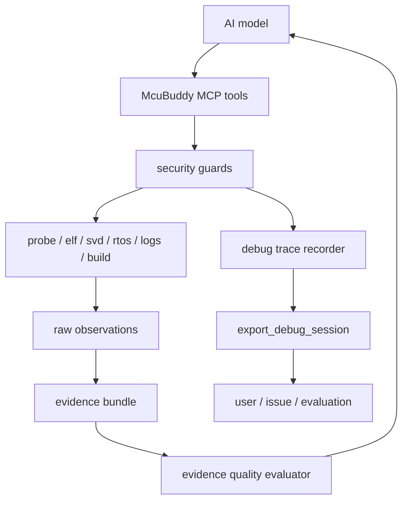

# AI-Native Evidence Runtime Refactor - Plan

## Goal Capsule

- **Objective:** 把 McuBuddy 从“带 AI 味道的 MCU 调试工具集合”推进为“模型无关的 AI-native MCU 证据运行时”：McuBuddy 不替 AI 下根因结论，只负责稳定采集真实硬件证据、安全执行动作、记录调试过程，并帮助 AI 验证假设。
- **Authority:** AI 的最终诊断和决策属于模型本身；McuBuddy 的产品价值必须落在真实硬件接入、证据质量、安全边界、可回放调试轨迹和验证闭环上。后续新增能力优先扩展 `collect_*_evidence`、debug trace、evidence quality 和 validation records，谨慎新增 `diagnose_*`。
- **Execution profile:** 以现有 `core`/`full` 工具面、`tools/evidence.py`、`result.py`、`security_guards.py`、`validation_records.py` 和 CLI 管理入口为基础，先统一证据包契约，再加入调试轨迹和证据质量层，最后建立场景评测与真实板卡验证记录。
- **Stop conditions:** 如果某项实现开始把启发式根因判断写死为产品结论，或为了追求“智能诊断”而绕过安全守卫、会话串行化、真实证据来源和模型解释权，则停止并重新设计。
- **Tail ownership:** 完成代码、测试、文档同步和验证；未经用户明确要求，不创建 git commit，不 push。

---

## Product Contract

### Summary

McuBuddy 的长期价值不是比 GPT 更会推理，而是让 GPT/Codex/Claude 等模型能安全、稳定、低成本地看到真实 MCU 状态并验证假设。项目应该成为 AI 的嵌入式调试感官和手：读取寄存器、内存、fault 状态、ELF/SVD/RTOS/UART/RTT/Build/Flash 证据；拦住危险动作；记录调试过程；把证据质量和缺失前置条件清楚交给模型。

### Problem Frame

AI 模型本身会越来越强，固定规则式 `diagnose_*` 很容易过时，也容易与模型推理竞争。McuBuddy 如果把核心价值放在“内置诊断结论”，就会被模型能力提升冲淡。

但模型永远需要外部工具提供真实世界状态。MCU 调试尤其依赖目标板供电、探针、PC/SP/LR、CFSR/HFSR、BFAR/MMFAR、RTOS task、UART/RTT 日志、ELF 符号、SVD 外设寄存器、构建与烧录结果。McuBuddy 应该把这些信息整理为可验证证据包，而不是输出未经采集事实证明的“最可能原因”。

### Requirements

**Evidence runtime identity**

- R1. 新增和改造的核心能力必须以证据采集、动作执行、质量评估或验证记录为中心，不以硬编码根因结论为中心。
- R2. `collect_*_evidence` 工具必须返回事实、缺失项、失败读取、安全影响、证据质量和推荐后续证据，不返回“最可能根因”。
- R3. 现有 `diagnose_*` 工具可继续保留在 `full` 中，但默认产品叙事和 Skill 指引必须从“诊断大脑”转为“证据运行时”。

**Evidence bundle contract**

- R4. 所有证据包必须使用统一结构，至少包含 `observations`、`missing`、`failed_reads`、`safety`、`evidence_quality`、`next_tools` 和 `raw_refs`。
- R5. 每条 observation 必须带稳定 `kind`、`source`、`status` 和结构化 `data`，便于模型和测试解析。
- R6. 证据包允许部分成功；缺 ELF、缺 SVD、目标未 halt、探针未连接、读取失败都必须作为结构化缺失或失败项返回。
- R7. 证据包 summary 只能描述采集完成度和关键缺失，不得夹带未经证据证明的根因推断。

**Debug trace and replay**

- R8. McuBuddy 必须能记录一个调试会话中的关键事件：工具调用、返回证据、危险动作、失败、用户/AI 提供的假设和验证结果。
- R9. 调试轨迹必须可导出为 JSON，供 issue、复盘、模型评测和用户排错使用。
- R10. 轨迹记录默认不保存大块内存原文、固件内容或敏感路径全文；必要时只保存摘要、哈希、大小和可遮蔽路径。

**Evidence quality and hypothesis verification**

- R11. McuBuddy 不判断最终根因，但必须能评估证据质量：`weak`、`partial`、`strong`。
- R12. 证据质量必须由前置条件和关键观测是否齐全决定，例如 ELF/SVD/RTOS/log/probe/halted state 是否可用。
- R13. 必须提供模型可用的“下一步证据建议”，例如 load ELF、load SVD、halt target、read RTT、collect crash evidence。
- R14. 必须支持记录 AI 假设和验证动作，但验证结果仍以证据事实表达，不写死“假设成立”的自然语言结论。

**Safety and action boundary**

- R15. 已新增的 `security_guards.py` 必须成为危险动作的硬边界，并继续覆盖内存读写、Flash erase/program、文件路径和 payload size。
- R16. 每次被硬守卫拒绝的动作必须能进入调试轨迹，帮助模型理解“为什么不能做”。
- R17. 每次允许的危险动作也必须记录安全上下文，包括确认状态、配置限制和影响范围。

**Validation and evaluation**

- R18. 项目必须建立 AI 调试场景评测，不评测“规则诊断是否聪明”，而评测模型使用 McuBuddy 后是否拿到关键证据、减少无效调用、避免危险动作、完成验证闭环。
- R19. validation records 必须区分自动测试、mock 验证、真实板卡验证，不得把未连接硬件的结果标记为硬件已验证。
- R20. 文档、Skill 和 README 必须明确 McuBuddy 是证据运行时，不是替代模型的诊断专家系统。

### Core Product Positioning

McuBuddy should be described as:

> McuBuddy is an AI-native MCU evidence runtime. It gives models safe access to real hardware state, structured debug evidence, guarded target actions, and replayable validation traces.

中文定位：

> McuBuddy 是面向 AI 的 MCU 证据运行时，负责把真实硬件状态、安全动作和可验证证据交给模型，而不是替模型假装成诊断大脑。

### Acceptance Examples

- AE1. `collect_crash_evidence` 在 HardFault 场景中返回 PC/SP/LR、fault registers、CFSR/HFSR flags、可用栈快照、ELF 源码映射状态和缺失项，但不写“根因是空指针”。
- AE2. 缺 ELF 时，证据包仍返回寄存器和 fault 状态，同时在 `missing` 中标明 `elf_symbols`，并在 `next_tools` 中建议 `configure_elf` 或 `elf_load`。
- AE3. 缺 SVD 时，外设证据包返回可读取的 raw register 或说明无法解析外设名，不生成外设根因结论。
- AE4. AI 尝试写内存但 `memory.allow_write=false` 时，工具返回硬守卫错误，并在 debug trace 中记录 blocked action。
- AE5. 一个调试会话可导出 JSON，包含工具调用顺序、证据质量变化、缺失项、危险动作和验证结果摘要。
- AE6. 评测场景用同一个输入比较 `without McuBuddy`、`core`、`full` 三种模式下关键证据获取率、危险误调用次数和工具调用次数。
- AE7. README 和 Skill 默认建议先采集证据，再由模型推理；不鼓励先调用高层 `diagnose` 得结论。

### Scope Boundaries

#### Included

- 统一证据包 schema 和 helper。
- 扩展现有 crash/startup/peripheral/RTOS evidence collectors。
- 新增 connection/build-flash evidence collectors。
- 新增 debug trace recorder 和 export 工具。
- 新增 evidence quality evaluator。
- 将安全守卫事件纳入调试轨迹。
- 新增 AI 调试场景评测 YAML 和结果记录格式。
- 更新 README、Quickstart、AI playbook、Skill 和 release notes 的产品定位。

#### Deferred to Follow-Up Work

- 自动运行真实 AI 模型的批量评测 harness。
- 云端或网页可视化 debug trace。
- 多板卡远程实验室管理。
- OpenOCD/GDB RSP 后端扩展。
- 更完整的芯片级内存权限矩阵。

#### Outside This Product's Identity

- 在 McuBuddy 内部调用 OpenAI/Anthropic API 并替用户选模型。
- 把自然语言 root-cause 规则做成核心产品。
- 删除现有 `full` 诊断工具。
- 绕过用户确认或配置守卫执行写入、擦除、烧录。

---

## Planning Contract

### Key Technical Decisions

- KTD1. **证据包是核心公共契约。** 新增能力优先沉淀到 `src/McuBuddy/tools/evidence.py` 和 MCP thin wrapper，不优先新增面向结论的 `diagnose_*`。
- KTD2. **诊断结论属于模型。** McuBuddy 可以返回 decoded flags、source mapping、task state、log fragments 和 next evidence，但不能把这些包装成未经验证的自然语言根因。
- KTD3. **证据质量是产品内判断，根因不是。** `weak/partial/strong` 评价的是输入是否足够、观测是否齐全、失败是否可解释，不评价最终 bug 是什么。
- KTD4. **调试轨迹记录事实和动作，不记录模型私有推理。** 如果 AI 或用户显式提交假设，可记录为 `hypothesis` 事件；McuBuddy 不偷录隐藏推理，也不把模型输出当事实。
- KTD5. **安全守卫事件必须可见。** 被拒绝的危险动作不是错误噪音，而是 AI 决策上下文的一部分，应该进入 debug trace。
- KTD6. **评测看闭环，不看单点结论。** 成功指标是关键证据获取率、无效调用减少、危险动作避免、假设可验证，而不是 McuBuddy 自己说对了多少根因。
- KTD7. **保持 `core` 简洁。** 新证据入口进入 `core` 前必须证明它代表高价值证据包；低层专家工具继续留在 `full`。

### High-Level Technical Design

### System-Wide Impact

- **MCP contract:** 增加少量高价值证据和 trace 工具，避免继续膨胀低层工具面。
- **Existing diagnosis:** `diagnose_*` 可继续存在，但文档和 Skill 默认转向 evidence-first。
- **Safety:** 危险动作从“被拦住即可”升级为“拦截原因也成为证据上下文”。
- **Tests:** 单元测试重点从文本 summary 转为结构化字段和证据质量。
- **Docs:** 对外叙事从“AI 调试工具”收敛为“AI-native evidence runtime”。

### Research Anchors

- `src/McuBuddy/tools/evidence.py`：现有四类证据入口。
- `src/McuBuddy/result.py`：统一结果 envelope。
- `src/McuBuddy/security_guards.py`：配置驱动硬安全守卫。
- `src/McuBuddy/tool_safety.py`：工具确认策略和安全等级。
- `src/McuBuddy/session.py`：会话状态和未来 trace recorder 落点。
- `src/McuBuddy/validation_records.py`：真实能力验证记录。
- `tests/evaluation/gpt5p6_scenarios.yaml`：现有模型场景评测入口。
- `skills/mcubug/SKILL.md`：AI 使用 McuBuddy 的默认行为指引。

---

## Implementation Units

### U1. Evidence bundle schema and helpers

- **Goal:** 建立统一证据包结构，让所有 `collect_*_evidence` 工具返回一致字段。
- **Requirements:** R1-R7。
- **Files:** `src/McuBuddy/tools/evidence.py`, `src/McuBuddy/result.py`, `tests/unit/test_evidence_tools.py`, `tests/integration/test_evidence_workflows.py`。
- **Approach:** 增加 helper：`make_observation`、`make_missing`、`make_failed_read`、`make_evidence_bundle`；兼容现有字段但补齐 `observations/missing/failed_reads/safety/evidence_quality/next_tools/raw_refs`。
- **Test Scenarios:**
  1. crash evidence 在未连接、部分连接、完整上下文三种状态下字段完整。
  2. 每条 observation 都有 `kind/source/status/data`。
  3. summary 不包含 `root cause`、`most likely`、`根因` 等结论措辞。
  4. 旧集成测试仍能读取现有关键字段。
- **Verification:** `pytest tests/unit/test_evidence_tools.py tests/integration/test_evidence_workflows.py`。

### U2. Evidence quality evaluator

- **Goal:** 评价证据是否足够让 AI 推理，而不是替 AI 推理。
- **Requirements:** R11-R14。
- **Dependencies:** U1。
- **Files:** `src/McuBuddy/evidence_quality.py`, `src/McuBuddy/tools/evidence.py`, `tests/unit/test_evidence_quality.py`。
- **Approach:** 定义按场景的质量规则：crash 需要 halted context + fault registers，peripheral 需要 SVD 或 raw register plan，RTOS 需要 ELF symbols 或 known RTOS metadata，startup 需要 vector/context/log 中至少两类。
- **Test Scenarios:**
  1. 缺 probe 时 quality 为 `weak`。
  2. 有寄存器但缺 ELF/SVD 时 quality 为 `partial`。
  3. 关键观测齐全且 failed_reads 为空时 quality 为 `strong`。
  4. evaluator 返回 blocking missing inputs 和 recommended next evidence。
- **Verification:** `pytest tests/unit/test_evidence_quality.py`。

### U3. Debug trace recorder

- **Goal:** 记录 AI 调试闭环，让用户能复盘“试过什么、拿到什么、哪里被拦住”。
- **Requirements:** R8-R10, R16-R17。
- **Dependencies:** U1。
- **Files:** `src/McuBuddy/debug_trace.py`, `src/McuBuddy/session.py`, `src/McuBuddy/mcp_execution.py`, `src/McuBuddy/mcp_tools/runtime.py`, `tests/unit/test_debug_trace.py`, `tests/unit/test_mcp_concurrency.py`。
- **Approach:** 在 `SessionState` 增加 trace recorder；`SessionToolRegistrar` 在工具执行前后记录 tool_call/tool_result/tool_error；安全守卫返回结果时记录 blocked_action；新增 `export_debug_session` 工具。
- **Test Scenarios:**
  1. 普通工具调用产生 start/end 事件。
  2. 工具异常产生 error 事件且不破坏原错误返回。
  3. 被安全守卫拒绝的写内存产生 blocked_action 事件。
  4. export 输出 JSON 可解析，并遮蔽过长 payload。
- **Verification:** `pytest tests/unit/test_debug_trace.py tests/unit/test_mcp_concurrency.py`。

### U4. Hypothesis and verification events

- **Goal:** 允许 AI 或用户显式记录假设和验证结果，但不把假设当事实。
- **Requirements:** R8, R14。
- **Dependencies:** U3。
- **Files:** `src/McuBuddy/tools/evidence.py`, `src/McuBuddy/mcp_tools/evidence.py`, `tests/unit/test_hypothesis_events.py`。
- **Approach:** 新增 `record_debug_hypothesis` 和 `record_verification_observation` 工具；假设事件只记录 text、source、related_evidence_ids；验证事件记录 observation refs、status 和 data。
- **Test Scenarios:**
  1. hypothesis 事件不改变 evidence_quality。
  2. verification observation 可关联到前一条 evidence bundle。
  3. 导出 trace 时 hypothesis 与 observation 分开呈现。
- **Verification:** `pytest tests/unit/test_hypothesis_events.py`。

### U5. Connection and build/flash evidence collectors

- **Goal:** 补齐 AI 调试闭环中的非 crash 场景证据。
- **Requirements:** R1-R7, R18。
- **Dependencies:** U1, U2。
- **Files:** `src/McuBuddy/tools/evidence.py`, `src/McuBuddy/mcp_tools/evidence.py`, `src/McuBuddy/tools/build.py`, `src/McuBuddy/tools/probe/core.py`, `tests/unit/test_evidence_tools.py`, `tests/integration/test_build_tools.py`。
- **Approach:** 新增 `collect_connection_evidence` 和 `collect_build_flash_evidence`；前者聚合探针枚举、后端配置、目标匹配和常见连接失败；后者聚合 build result、flash result、firmware metadata、verify 状态和安全限制。
- **Test Scenarios:**
  1. 无探针时 connection evidence 返回 warning observation 和 next_tools。
  2. 目标未配置时 connection evidence 标记 missing target。
  3. build 失败时 build evidence 保留命令结果、log path、错误摘要。
  4. flash 被安全守卫拦截时 build/flash evidence 标记 blocked action。
- **Verification:** `pytest tests/unit/test_evidence_tools.py tests/integration/test_build_tools.py`。

### U6. Safety guard trace integration

- **Goal:** 让危险动作的允许/拒绝成为 AI 可见上下文。
- **Requirements:** R15-R17。
- **Dependencies:** U3。
- **Files:** `src/McuBuddy/security_guards.py`, `src/McuBuddy/tools/probe/memory.py`, `src/McuBuddy/tools/probe/flash.py`, `src/McuBuddy/tools/build.py`, `tests/unit/test_security_guards.py`, `tests/unit/test_debug_trace.py`。
- **Approach:** 扩展 guard 返回结构，包含 `action`, `requested_scope`, `config_guard`, `risk`; 工具层将 guard result 交给 trace recorder。
- **Test Scenarios:**
  1. 禁止写内存时 trace 记录 address 和 length，但不记录完整 payload。
  2. 禁止 flash erase 时 trace 记录 chip/range erase intent。
  3. 文件路径被拒绝时 trace 记录规范化路径或遮蔽路径。
- **Verification:** `pytest tests/unit/test_security_guards.py tests/unit/test_debug_trace.py`。

### U7. AI debugging evaluation scenarios

- **Goal:** 用场景证明 McuBuddy 提升 AI 调试闭环，而不是证明内置规则会诊断。
- **Requirements:** R18-R19。
- **Dependencies:** U1-U6。
- **Files:** `tests/evaluation/ai_debug_runtime_scenarios.yaml`, `docs/ai-tool-surface-evaluation.md`, `docs/board-validation-guide.md`, `src/McuBuddy/validation/*.json`, `tests/unit/test_validation_records.py`。
- **Approach:** 定义 HardFault、startup fail、peripheral no output、RTOS stuck、build/flash fail、probe connection fail 六类场景；记录 required evidence、forbidden actions、success signals 和 trace expectations。
- **Test Scenarios:**
  1. 每个场景都有 required evidence 和 forbidden actions。
  2. 场景文件可被测试解析。
  3. validation records 区分 mock、automated、hardware。
- **Verification:** `pytest tests/unit/test_validation_records.py` 加场景解析测试。

### U8. Documentation and Skill repositioning

- **Goal:** 把产品叙事从“AI 帮你诊断”改为“AI 证据运行时”。
- **Requirements:** R20。
- **Dependencies:** U1-U7。
- **Files:** `README.md`, `README_zh.md`, `docs/quickstart.md`, `docs/ai-playbook.md`, `docs/ai-examples.md`, `docs/tool-reference.md`, `docs/mcubug-skill.md`, `skills/mcubug/SKILL.md`, `skills/mcubug/references/*.md`, `RELEASE_NOTES.md`, `tests/unit/test_skill_reference_sync.py`。
- **Approach:** 文档默认流程改为 gather evidence -> model reasons -> verify hypothesis；把 `diagnose_*` 描述为 full 专家/legacy 辅助，不作为默认价值主线。
- **Test Scenarios:**
  1. Quickstart 默认先调用 evidence collectors。
  2. Skill 不鼓励模型直接追求单次 diagnose 结论。
  3. docs 与 skill references 同步无漂移。
- **Verification:** `python skills/mcubug/scripts/sync_references.py --check`, `python skills/mcubug/scripts/validate_skill.py`, `pytest tests/unit/test_skill_reference_sync.py`。

---

## Verification Contract

| Gate | Command or evidence | Covers | Passing signal |
|---|---|---|---|
| Evidence schema | `pytest tests/unit/test_evidence_tools.py tests/integration/test_evidence_workflows.py` | U1 | 所有证据包字段完整且不输出根因结论 |
| Evidence quality | `pytest tests/unit/test_evidence_quality.py` | U2 | weak/partial/strong 和 next evidence 规则通过 |
| Debug trace | `pytest tests/unit/test_debug_trace.py tests/unit/test_mcp_concurrency.py` | U3, U6 | 工具调用、错误、blocked action 可导出 |
| Hypothesis events | `pytest tests/unit/test_hypothesis_events.py` | U4 | 假设和验证观测分离记录 |
| Build/connection evidence | `pytest tests/unit/test_evidence_tools.py tests/integration/test_build_tools.py` | U5 | 连接、构建、烧录失败以证据形式返回 |
| Safety guards | `pytest tests/unit/test_security_guards.py tests/unit/test_flash_tools.py tests/unit/test_tool_safety.py` | U6 | 危险动作仍在后端调用前被拦截 |
| Evaluation scenarios | `pytest tests/unit/test_validation_records.py` | U7 | 场景和验证记录可解析且分类清楚 |
| Documentation sync | `python skills/mcubug/scripts/sync_references.py --check` | U8 | docs 与 Skill references 无漂移 |
| Skill validation | `python skills/mcubug/scripts/validate_skill.py` | U8 | Skill 结构和链接有效 |
| Static quality | `ruff check src tests scripts skills/mcubug/scripts` | U1-U8 | 无 Ruff 问题 |
| Full suite | `pytest` | U1-U8 | 全部单元和集成测试通过 |

---

## Definition of Done

- McuBuddy 的默认产品叙事和 Skill 指引明确为 AI-native evidence runtime。
- 所有 `collect_*_evidence` 工具返回统一证据包结构。
- 证据包不输出未经事实证明的根因结论。
- 证据质量 evaluator 能标出 weak/partial/strong、关键缺失项和推荐下一步证据。
- 调试会话能导出可解析 JSON trace，包含工具调用、证据、错误、安全拦截和显式假设/验证事件。
- 安全守卫的拒绝和允许上下文可进入 trace，且不泄露大块 payload 或敏感路径全文。
- 新增 connection 和 build/flash evidence collectors 覆盖首次连接和构建烧录闭环。
- AI 调试评测场景衡量证据获取、危险动作避免、工具调用效率和验证闭环，而不是内置诊断结论。
- README、Quickstart、AI playbook、Skill、release notes 和 references 已同步。
- `pytest`、Ruff、Skill 校验和 references 同步检查通过。
- 未经用户明确要求，不创建 git commit，不 push。
